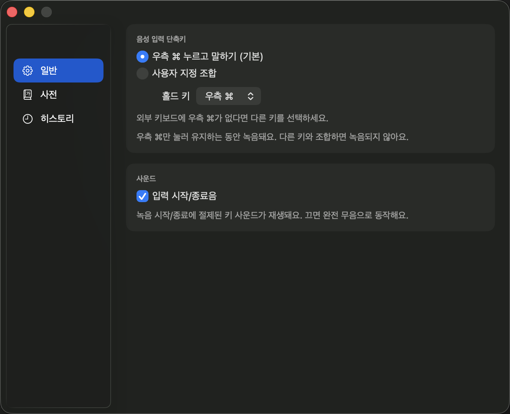
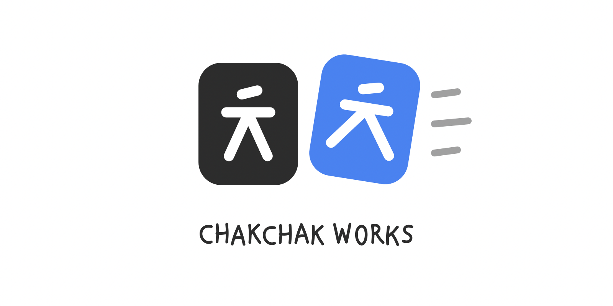

<p align="right">
  <a href="README.md">한국어로 보기</a>
</p>

<p align="center">
  
</p>

<h1 align="center">받아써 (Badasseo)</h1>

<p align="center">
  Say it, and it's written. Speak instead of type on your Mac — entirely on your Mac.
</p>

<p align="center">
  <a href="LICENSE"></a>
  
  
  <a href="https://github.com/sponsors/ulBible"></a>
</p>

*A **Chakchak Works** app — small Mac tools that snap right in.*

<p align="center">
  
</p>

Badasseo is a **Korean-first** voice input app for the macOS menu bar. Hold a shortcut
and speak; a local Whisper model transcribes what you said and inserts it right at your
cursor. No server, no account, no subscription. Optimized for Korean but not
Korean-only — mixed Korean-English sentences and even full English sentences come
out as spoken.

## What's different

- **It just works after install** — the language is fixed to Korean. Auto language
  detection is prone to hallucinating Korean speech into unrelated English text;
  Badasseo removes that failure path entirely by design. The fix is a safety net
  against mistranslation, not a limitation — speak English and you get English
  back, verbatim.
- **Privacy** — everything runs locally via whisper.cpp + Metal. No network calls for
  transcription, no accounts, no subscriptions. See [PRIVACY.md](PRIVACY.md) for details.
- **Works fully with zero permissions** — the Accessibility permission is opt-in. Without
  it, ⌥Space + manual ⌘V gives you the complete feature set.

## Usage

1. Hold the right ⌘ key (or another hold key you pick in Settings) and speak.
2. Release it — the transcribed text is inserted right at your cursor.

If you'd rather not grant Accessibility access, use ⌥Space mode instead — no permission
needed; the transcription lands on your clipboard and you paste it yourself with ⌘V.

<p align="center">
  
</p>

## Install

One line with Homebrew:

```bash
brew install --cask ulBible/tap/badasseo
```

Or download the latest `Badasseo-x.y.z.zip` from
[Releases](https://github.com/ulBible/badasseo/releases), unzip, and drag
`Badasseo.app` into `/Applications`. Requires macOS 14+.

Badasseo keeps itself up to date: it checks the latest release in the
background (Sparkle) and offers new versions as they ship. You can also check
manually via the menu-bar icon → **Check for Updates…**.

### Building from source

```bash
git clone https://github.com/ulBible/badasseo.git
cd badasseo
./scripts/bundle.sh release
open build/Badasseo.app
```

**Requirements**: Apple Silicon Mac, macOS 14+. On first launch it downloads the
speech-recognition model (Whisper large-v3-turbo, ~1.6GB) once.

## Model choice

Badasseo runs stock Whisper large-v3-turbo, chosen through a blind-comparison
benchmark on real speech recordings. Methodology and numbers are published in
[bench/report.md](bench/report.md).

## Permissions

| Permission | Required? | Used for |
|---|---|---|
| None | No | Full functionality via ⌥Space + manual ⌘V |
| Microphone | Only while recording | Only while the shortcut is held; discarded immediately after processing |
| Accessibility | Opt-in | Detecting the right-⌘ hold and auto-inserting text at your cursor (synthesized ⌘V) |

## Support

Badasseo is free and open source (MIT). If it's useful to you, consider supporting it.

[Sponsor Badasseo ❤️](https://github.com/sponsors/ulBible)

## License

[MIT](LICENSE)

---

<p align="center">
  <a href="https://github.com/ulBible">
    
  </a>
</p>
<p align="center">
  Made by <strong>Chakchak Works</strong> · by <a href="https://github.com/ulBible">ulBible</a>
</p>
