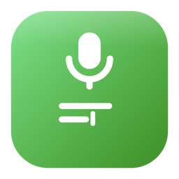

<p align="right">
  <a href="README.en.md">Read in English</a>
</p>

<p align="center">
  
</p>

<h1 align="center">받아써 (Badasseo)</h1>

<p align="center">
  말하면, 받아써. 맥에서 키보드 대신 말로 — 전 과정이 내 맥 안에서.
</p>

받아써는 macOS 메뉴바에 상주하는 한국어 음성입력 앱입니다. 단축키를 누른 채 말하면
로컬 Whisper가 전사해 커서 위치에 그대로 입력합니다. 서버도, 계정도, 구독도 없습니다.

## 뭐가 다른가

- **설치하면 그냥 됨** — 언어를 한국어로 고정했습니다. 자동 언어 감지 방식은
  한국어 발화를 엉뚱한 영어로 잘못 옮기는 환각 문제가 흔한데(직접 확인한 문제),
  받아써는 애초에 그 실패 경로 자체가 없습니다.
- **프라이버시** — 모든 처리는 whisper.cpp + Metal로 이 맥 안에서만 일어납니다.
  서버 전송, 계정, 구독 없음. 자세한 내용은 [PRIVACY.md](PRIVACY.md).
- **개발 용어 사전 내장** — "깃허브"→"GitHub", "풀 리퀘스트"→"PR"처럼 개발자가 자주
  쓰는 영어 용어의 한글 근사음을 원래 표기로 되돌립니다. 설정에서 직접 추가·수정 가능.
- **권한 제로로도 완전 동작** — 손쉬운 사용 권한을 옵트인으로 설계했습니다. 권한 없이
  ⌥Space + 수동 ⌘V만으로도 전체 기능이 동작합니다.

## 사용법

1. 우측 ⌘(또는 설정에서 고른 다른 홀드 키)를 누른 채 말합니다.
2. 손을 떼면 전사된 텍스트가 커서 위치에 바로 입력됩니다.

손쉬운 사용 권한을 허용하고 싶지 않다면 ⌥Space 모드를 선택하세요 — 권한 없이,
전사 결과가 클립보드에 담기고 ⌘V로 직접 붙여넣습니다.

## 설치

아직 정식 배포(DMG·앱스토어)는 준비 중입니다. 지금은 소스에서 직접 빌드합니다.

```bash
git clone https://github.com/ulBible/badasseo.git
cd badasseo
./scripts/bundle.sh release
open build/Badasseo.app
```

**요구사항**: Apple Silicon 맥, macOS 14 이상. 첫 실행 시 한국어 인식 모델
(Whisper large-v3-turbo, 약 1.6GB)을 한 번 다운로드합니다.

## 왜 stock whisper인가

파인튜닝된 한국어 모델 3종을 벤치마크했지만 채택하지 않았습니다. 블라인드 비교
(가림·셔플, 유효 26건)에서 **stock large-v3-turbo가 62%로 선호**되었고, CER 수치가
좋았던 파인튜닝 모델은 실제 발화에서 내용 오류가 더 많았습니다 — 학습 데이터
분포에만 강한 과적합이었습니다. 전체 과정과 수치는 [bench/report.md](bench/report.md)에서
확인할 수 있습니다.

## 권한

| 권한 | 필요한가 | 용도 |
|---|---|---|
| 없음 | 아니오 | ⌥Space + 수동 ⌘V로 완전 동작 |
| 마이크 | 녹음 시에만 | 단축키를 누르고 있는 동안만 사용, 처리 즉시 폐기 |
| 손쉬운 사용 | 옵트인 | 우측 ⌘ 홀드 감지 + 커서 위치 자동 입력(⌘V 합성)용 |

## 후원

받아써는 무료·오픈소스(MIT)입니다. 도움이 되었다면 후원으로 응원해주세요.

[Sponsor 받아써 ❤️](https://github.com/sponsors/ulBible)

## 라이선스

[MIT](LICENSE)

---

<p align="center">
  Made by <strong>Chakchak Works</strong> · by <a href="https://github.com/ulBible">ulBible</a>
</p>
